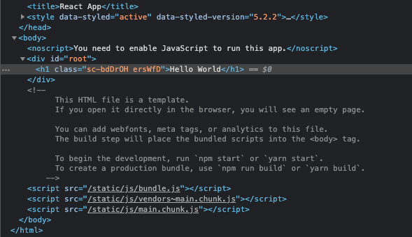

import { PrimaryButton, SecondaryButton, PlainButton } from "./button.js";

In this article, we’ll learn how to use styled-components with React.js. Styled-components is a CSS-in-JS library and is not a concept unique to React.js but broadly used in single-page applications such as React.js, Angular.js, etc. It essentially allows you to write CSS as part of your “component.” We’re going to use styled-components with create-react-app (CRA) to cover some concepts and core functionality.

These concepts will work with any framework using react.js, such as Gatsby.js or Next.js.

If you're in a rush and just want to download the files, [grab it here from my GitHub repo](https://github.com/rolandoyera/styled-components-reactjs-examples).

## Pre-requisites

You’ll have to have some knowledge of React’s framework, CSS, and styled-components. A small amount of JavaScript understanding will keep you from getting lost, also. If you’ve used create-react-app already, no need to hold you up any longer; let’s get started.

## Syntax Highlighting & Intellisense

Consider using a syntax highlighting extension for your IDE; I use [vscode-styled-components](https://marketplace.visualstudio.com/items?itemName=jpoissonnier.vscode-styled-components). Since we’ll be coding CSS-in-JS, this helps tremendously. Have a look at the one I use [here](https://marketplace.visualstudio.com/items?itemName=jpoissonnier.vscode-styled-components).

## Environment

First, let’s install react.js’ create-react-app template, our styled-components dependency, and clean-up the files.

```
npx create-react-app styled-components-starter
```

Next, we’re going to add our dependencies for our project, which is styled-components.

```
npm install styled-components
```

There are multiple files and images that I remove from the src folder to keep things tidy. This is what remains after the clean-up:

```bash
📦 styled-components-starter
 ┣ 📁 node_modules
 ┣ 📁 public
 ┣ 📂 src
 ┃ ┣ 📄 App.js
 ┃ ┗ 📄 index.js
 ┣ 📄 .gitignore
 ┣ 📄 package-lock.json
 ┣ 📄 package.json
 ┣ 📄 README.md
 ┗ 📄 yarn.lock
```

I removed everything except the app.js and index.js files in the src folder and cleaned-up the code in the app.js file:

<pre className="code-title">src/App.js</pre>
```jsx
function App() {
	return <div>Hello World</div>;
}

export default App;
```

Here's the index.js file:

<pre className="code-title">src/index.js</pre>
```jsx
import React from 'react';
import ReactDOM from 'react-dom';
import App from './App';

ReactDOM.render(
  <React.StrictMode>
    <App />
  </React.StrictMode>,
  document.getElementById('root')
);

```

## Basic Structure

We can create a unique tag naming convention using styled-components that utilizes es6 syntax. We can name the element whatever we like, put some styling on it, and re-use it throughout our project.

This concept makes it easy to read and understand code but, consider how it will render on the client-side. Instead of div tags, consider using section or article tags as wrappers for better structure and accessibility when possible. Doing this makes for good practice, plus search engines and browsers like it.

## Basic Components

Our CSS syntax with styled-components will use regular kebab-case instead of camel-case, such as margin-top instead of marginTop. All of the same CSS rules apply here as if we were using a standard CSS stylesheet. We can, and will, use JavaScript inside our CSS, which is powerful and fun to use. This functionality makes it easy for theme application or component state changes.

Let’s put an h1 tag around our “Hello World” title, and we’ll make a new element called “H1”. We’ll do this by:

+ importing styled-components
+ creating a JavaScript variable named H1
+ adding CSS to H1
 
Have a look at the code then we’ll discuss it below.

<pre className="code-title">src/App.js</pre>
```jsx
import styled from 'styled-components'

const H1 = styled.h1`
  font-size: 2.5rem;
  font-family: sans-serif;
  text-align: center;
  margin: 2rem 0;
`;

function App() {
  return <H1>Hello World</H1>;
}

export default App;

```

We’re using the standard JavaScript syntax to assign our variable `const H1`; then, we attach our import “styled” via dot notation to our HTML element, `const H1 = styled.h1`. To encase our CSS, we use ` backticks thanks to JavaScript’s es6 syntax:

```jsx
const H1 = styled.h1` CSS here `;
```

The code above is your basic set-up for any HTML element you’d like to style. A div would be `const Div = styled.div`, a button would be `const Button = styled.button`, and so on.

## Extending Components

Extending is an easy way to have different variants of your components. It keeps your styling code organized, and it’ll also cut down on the amount of code. An excellent example of trying this would be a button, so let’s make one, and we’ll extend it to make a secondary button.

Next steps:

+ create a Button.js file in your src folder
+ import styled from styled-components
+ add button syntax and CSS


<pre className="code-title">src/Button.js</pre>
```jsx
import styled from 'styled-components'

export const PrimaryButton = styled.button`
  color: #fff;
  background-color: #0d6efd;
  border:1px solid transparent;
  font-size: 1.1rem;
  padding: 0.5rem 1rem;
  border-radius: 5px;
  margin: 2rem 0;
  cursor: pointer;
`;
```

<PlainButton> Clickety Click </PlainButton>

<br/>
<br/>

Next we'll extend this button to make a secondary button.


<pre className="code-title">src/Button.js</pre>
```jsx
import styled from 'styled-components'

export const PrimaryButton = styled.button`
  color: #fff;
  background-color: #0d6efd;
  border:1px solid transparent;
  font-size: 1.1rem;
  padding: 0.5rem 1rem;
  border-radius: 5px;
  margin: 2rem 0;
  cursor: pointer;
`;

export const SecondaryButton = styled(PrimaryButton)`
  color: #0d6efd;
  background-color: transparent;
`;
```

Notice the secondary button method we’re using, `styled(PrimaryButton)`. Since we’re extending the original `styled.button`, which uses dot-notation, we need to add a “method” or parenthesis instead of the dot to extend it, which is how we arrived at `styled(PrimaryButton)`. If we wanted to add a tertiary button, we could add another method and extend SecondaryButton, `styled(SecondaryButton)`.

Since we’re extending the primary button, we only need to add or change any styling that’s different from the primary. This would be the equivalent of Bootstrap’s button CSS classes as so:

```HTML
<button class="btn btn-primary">Click Me</button>
```

One big problem with our buttons is that they’re lifeless. We’ll need to add pseudo-classes for hover and focus CSS.

## Pseudo Classes

Adding pseudo-classes in styled-components uses a syntax that’s similar to SCSS. We’ll need to nest it and use `&:` to make `&:hover` or `&:yourPsuedoClass`. 

Let’s add those to our buttons as follows:

<pre className="code-title">src/Button.js</pre>
```jsx
import styled from 'styled-components'

export const PrimaryButton = styled.button`
  color: #fff;
  background-color: #0d6efd;
  border:1px solid transparent;
  font-size: 1.1rem;
  padding: 0.5rem 1rem;
  border-radius: 5px;
  margin: 2rem 0;
  cursor: pointer;
  transition: all 0.15s;
    &:hover {
      background-color: #3988ff;
    }
    &:focus {
      color: #fff;
      background-color: #0d6efd;
      border-color: #0d6efd;
      box-shadow: 0 0 0 0.25rem rgba(49, 132, 253, 0.5);
      outline: none;
    }
`;

export const SecondaryButton = styled(PrimaryButton)`
  color: #0d6efd;
  background-color: transparent;
    &:hover {
      background-color: #3988ff;
      color: #fff;
    }
`;
```

<PrimaryButton> Clickety Click </PrimaryButton>{" "}

<SecondaryButton>Just Click</SecondaryButton>

<br />
<br />

Not the best-looking buttons, but I think it gets the point across. Let's import the buttons into our app.js file:

<pre className="code-title">src/App.js</pre>
```jsx
import { PrimaryButton, SecondaryButton } from './Button'

function App() {
  return (
    <>
      <H1>Hello World</H1>
      <PrimaryButton>Clickety Click</PrimaryButton>
      <SecondaryButton>Just Click</SecondaryButton>
    </>
  )
}

export default App;
```

<br />
<br />


## Using Global Styles

styled-components has a function to create global styles for your app. This is great for resetting CSS or applying styles that are used throughout your entire app. First, we need to create a separate file and import the `createGlobalStyle` module.

<pre className="code-title">src/GlobalStyle.js</pre>
```jsx
import { createGlobalStyle } from "styled-components";
```

As I said earlier, this feature is great for resetting CSS. What this file will do is place the CSS in the head of every page on your site, and all normal CSS syntax rules apply here also. Let’s have a look at some code:

<pre className="code-title">src/GlobalStyle.js</pre>
```jsx
import { createGlobalStyle } from "styled-components";

export const GlobalStyle = createGlobalStyle`
* {
  box-sizing: border-box;
  margin: 0;
  padding: 0;
  list-style: none;
}
body {
  background-color: #fff;
  line-height: 1.5;
  font-size: 1.1rem;
  font-family: sans-serif;
  font-weight: 300;
  color: #000;
}
`;

```

The possibilities are endless but keep in mind that this will go into the head of all your files. Be on the lookout for any conflicting code.

We’ll need to import this into our app in order for it to work. We’ll do that in our App.js file since it’s controlling the entire app.

<pre className="code-title">src/App.js</pre>
```jsx
import { PrimaryButton, SecondaryButton } from './Button'
import { GlobalStyle } from "./GlobalStyle";

function App() {
  return (
    <>
    <GlobalStyle />
      <H1>Hello World</H1>
      <PrimaryButton>Clickety Click</PrimaryButton>
      <SecondaryButton>Just Click</SecondaryButton>
    </>
  )
}

export default App;
```

Have a look at what we’ve done so far, which is not much, but notice how everything is styled without a single stylesheet. We have element-targeted CSS and global CSS coming out of our JavaScript files. That’s pretty cool.

## How Components & Styled-Components Work

A Styled Component is the combination of an element, JSX, and the CSS rules that style it. Let’s use the H1 component that we created as an example. We have an element, which is h1, the JSX, which is the coding that allows us to use JavaScript with CSS, and we have our CSS. React will render this in the browser, but we won’t see the H1 tag we’ve created; we’ll see the HTML h1 (lowercase) tag. A “class” will be attached to our h1 with a class name generated by React and has no pattern to it; it’s random.



The `H1` that we see in React is the JavaScript tag that will render HTML, so a proper element needs to be attached to it. When you’re styling your components or elements with styled-components, keep this in mind. You can use any HTML element like `styled.button`, `styled.div`, `styled.input`, etc. There’s an exception to this when you’re extending components. 


To recap, we created an H1 and global CSS component and styled them with styled-components. We also created button components and extended them to make primary and secondary buttons, and we learned how to use pseudo-classes with styled-components. Lastly, we learned how styled-components render the elements in the browser via React.js.

Please check out my article on [themes and dark mode with styled-components](https://javascriptarticles.com/how-to-use-themes-and-dark-mode-with-styled-components-and-reactjs/).

This was fun to make, and I hope this helps you on your learning journey.


<Card>
<h4>Resources</h4>
<br />
<a className="footnote" href="https://styled-components.com/docs/basics#getting-started">styled-components- Getting Started</a><br />
<a className="footnote" href="https://reactjs.org/docs/components-and-props.html">reactjs.org- Components and Props</a><br />

</Card>
