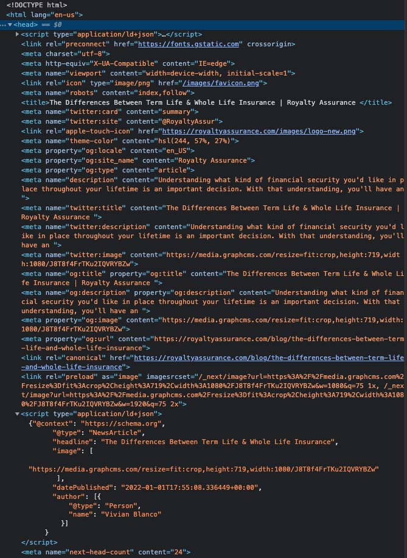

My latest project involved making a website, and I used NextJS as the framework. It surely did not disappoint, as you can see from the image above 💯. In this article, we'll discuss creating a _document.js file, organizing the NextJs head component, creating a dynamic SEO head component, and optimizing SEO with the following:

  + "regular" title and description
  + og title and description
  + twitter card
  + canonical url
  + structured data

We'll also briefly discuss some best practices for the meta tags and structured data applied to the site. We can also create "global variables" to keep our information centralized to one file. In this fashion, if a piece of information changes, we don't have to rifle through all the files and potentially expose ourselves to mistakes. So, let's get started!

We'll begin with our global variables since we'll use these straight away. I will keep the number of variables to a minimum but use your imagination to apply them. They don't only work for meta tags and are helpful for phone numbers, addresses, or anything you have throughout your site more than once.

I'll give you an example, the URL for the site's logo. If the file needs to be changed from logo.png to company-logo.jpg, I only need to go to one spot to change it for the entire site.

<br />

## Creating Global Variables

Create a new folder at the root of your project and call it "data" (or to your preference). In that folder, we'll create a file called "siteMetadata.js." This file will contain the "siteMetadata" object we'll use throughout the site. This file is suitable for metadata and anything subject to change.

<pre className="code-title">./data/siteMetadata.js</pre>
```js
const siteMetadata = {
    companyName: "Example",
    phoneNumber: "(xxx) xxx-xxxx",
    siteUrl: "https://example.com",
    siteLogo: "https://example.com/images/logo.png",
    siteLogoSquare: "https://example.com/images/logox200.png",
    email: "yourName@example.com",
    twitter: "https://twitter.com/example.page",
    twitterHandle: "@example",
    facebook: "https://www.facebook.com/example.page",
    instagram: "https://www.instagram.com/example.page",
    linkedin: "https://www.linkedin.com/in/example.page"
}

export default siteMetadata
```

<br />

We can easily import this file and use regular dot notation when accessing our variables. If your logo appears in the header, footer, and other areas of your site, you can apply it everywhere needed with ``````. We can take it a step further and also propagate the alt description with a company name global variable ``````. If changing the logo or logo name is necessary, simply come to siteMetadata.js and change it here to reflect the changes throughout the site.

<br />

## Creating A _document File

Creating a custom _document.js file will extend the default document used on every page, which will control the HTML structure. This is where you can put links for external files, such as linking a font from Google Fonts, and is a good place for meta tags that will remain constant throughout the site. For example, tags for favicon and charset remain constant, so I placed those along with others in this file to keep them out of the way.

<div className="important"><p>The only tag that Vercel suggests not to use in the _document.js file is the viewport tag.</p>

</div>

You should also set the lang attribute to the HTML tag to reflect the language of the site. In my case, I used "```en-us```."

<pre className="code-title">./pages/_document.js</pre>
```js
import Document, { Html, Head, Main, NextScript } from 'next/document'

class MyDocument extends Document {

  render() {
    return (
      <Html lang="en-us">
        <Head>                  
          <meta charSet="utf-8" />
          <meta httpEquiv="X-UA-Compatible" content="IE=edge" />
          <link rel="icon" type="image/png" href="/images/favicon.png" />
          <meta name="robots" content="index, follow" />
        </Head>
        <body>
          <Main />
          <NextScript />
        </body>
      </Html>
    )
  }
}

export default MyDocument
```

<br />

## Creating A Dynamic Head Component

Next, we'll need to create a file for our dynamic head component. I called mine HeadSeo.js; this is where most of our metadata mark-up will reside.

```js
import Head from "next/head"

const HeadSeo = () => {
    return (
        <Head>

        </Head>
    )
}

export default HeadSeo
```

Next, initialize meta-variables to be used in other components. Items such as title, description, and image URL can be used many times here, reducing the amount of code needed in our other components. I found that using the title, description, canonicalUrl, ogTwitterImage, and ogType was sufficient for any meta tag thrown at me.

```js
import Head from "next/head"

const HeadSeo = ({
    title,
    description,
    canonicalUrl,
    ogTwitterImage,
    ogType,
    children,
}) => {

    return (
        <Head>

        </Head>
    )
}

export default HeadSeo
```

We can start returning our meta tags along with the global variables we created earlier with these initialized.


```js
import Head from "next/head"
import siteMetadata from "@data/siteMetadata"

const HeadSeo = ({
    title,
    description,
    canonicalUrl,
    ogTwitterImage,
    ogType,
    children,
}) => {

    return (
        <Head>
            //basic metadata
            <title>{title}</title>
            <meta
                name="viewport"
                content="width=device-width, initial-scale=1"
            />
            <meta name="description" content={description} />
            //twitter metadata
            <meta name="twitter:card" content="summary" />
            <meta name="twitter:site" content={siteMetadata.twitterHandle} />
            <meta name="twitter:title" content={title} />
            <meta name="twitter:description" content={description} />
            <meta name="twitter:image" content={ogTwitterImage} />
            //canonical link
            <link rel="canonical" href={canonicalUrl} />
            //open graph metadata
            <meta property="og:locale" content="en_US" />
            <meta property="og:site_name" content={siteMetadata.companyName} />
            <meta property="og:type" content={ogType} />
            <meta property="og:title" content={title} />
            <meta property="og:description" content={description} />
            <meta property="og:image" content={ogImageUrl} />
            <meta property="og:url" content={canonicalUrl} />
            {children}
        </Head>
    )
}

export default HeadSeo
```

We now get a good view of what each page will contain in its head section. Next, let's discuss what we're using to better understand our metadata; then, we'll use our newly created component in our pages.

## Title

Just as it sounds, the title for every document. The title is displayed in the browsers tab and typically displays 55-60 characters. Search engines will omit anything longer in the results. Make sure your titles are informative and unique for each page. 

By initializing a title variable in our component, we can use it for our regular title metatag, the open graph title metatag, and our Twitter card.

## Description

Each page should have an informative and unique description. Descriptions longer than 160 characters are typically not displayed. While there's no minimum, it should be long enough to describe the page accurately.

By initializing a description variable in our component, we can use it for our regular description metatag, the open graph description metatag, and our Twitter card.

## Canonical

Google recommends using canonical tags for duplicate content on your site. However, if a canonical link is not explicitly set, Google will make that choice for you, leading to unexpected results. Be aware, even though you select a canonical link, Google may choose a different page if it feels necessary. Since we initialized it in our component, we'll have one explicitly set for every page.

By initializing a canonicalUrl variable in our component, we can use it for our canonical Link tag and the open graph URL metatag.

## Open Graph
Facebook's Open Graph has quite a few meta tags, and we have most, but not all, covered. What I did include is enough to display shared posts correctly, but that's it. If you have one, you'll have to add properties for video or your Facebook app id. 

We initialized a variable called ogType, and I should explain how we'll use that. The "type" property has different uses depending on the page of our website. For example, the "type" for pages such as index, contact, about, or similar will be "website," and for blog posts will be "article."

Also, the description length maximum is 60 characters, but we have our ```{description}``` variable, which we also use for our regular description meta tag. However, the standard description is 160 characters, so what do we do? You can split the two if you'd like, but there's no penalty for passing open graphs 60 characters maximum. Keep in mind that it will be truncated.

## Twitter Card
Like Open Graph, we have most bases covered here, but not all. We have enough to display a page or post properly. Twitter's max description length is 200 characters, so we're safe with the 160 character max length we set for our variable.

## Dynamic Head Component: Homepage

Finally, we can use our dynamic head component to visualize how we saved ourselves from coding repetition. Again, this works exceptionally well for static pages, and we'll look at how to use this in a blog section next.

<pre className="code-title">./pages/index.js</pre>
```js
import siteMetadata from "data/siteMetadata"
import HeadSeo from "components/HeadSeo"

const Index = () => {
    return (
        <>
            <HeadSeo
                title={`Your Awesome Title Here`}
                description={`Your description goes here on every page. 
                  Keep character count between 140 to 160 characters`}
                canonicalUrl={siteMetadata.siteUrl}
                ogTwitterImage={siteMetadata.siteLogoSquare}
                ogType={"website"}
            />

            <div>
                <h1>Home Page</h1>
            </div>
        </>
    )
}

export default Index
```

<br />

## Dynamic Head Component: Blog

Here we'll look at utilizing the dynamic head component in a blog page. Since this is a NextJS blog, it's initialized with {post} that maps through posts. We can use ```post.title```,  ```post.description```, and depending on your set-up, ```post.image.url.``` The site for this project uses graphCMS, and I created all the parameters on their site.

<pre className="code-title">./pages/blog/[slug].js</pre>
```js
import { getPosts } from "../../services"
import siteMetadata from "data/siteMetadata"
import HeadSeo from "components/HeadSeo"

const Post = ({post}) => {
    return (
        <>
            <HeadSeo
                title={`${post.title} | ${siteMetadata.companyName} `}
                description={post.description}
                canonicalUrl={`${siteMetadata.siteUrl}/blog/${post.slug}`}
                ogImageUrl={post.ogImage.url}
                ogType={"article"}
            />

            <div>
                <h1>post.title</h1>
            </div>
        </>
    )
}

export async function getStaticPaths() {
    const posts = await getPosts()
    return {
        paths: posts.map(({ node: { slug } }) => ({ params: { slug } })),
        fallback: false,
    }
}

export default Post
```

<br />

## What About The Children?

We set children as a ```{prop}``` in our dynamic head component but have yet to use it. But, of course, you want all the goodies for SEO if you're anything like me, so I left this available for our structured data mark-up. The following section will show the mark-up for the blog post page.

## Structured Data: JSON-LD

We have an opportunity to give search engines more information on what our site, or page, in this case, is about. In addition, we can use the structured data here since we exposed the children prop in our dynamic head component. Use this link to read more about structured data on Google's site.

<pre className="code-title">./pages/blog/[slug].js</pre>
```js
import { getPosts } from "../../services"
import siteMetadata from "data/siteMetadata"
import HeadSeo from "components/HeadSeo"

const Post = ({post}) => {
    return (
        <>
            <HeadSeo
                title={`${post?.title} | ${siteMetadata.companyName} `}
                description={post?.description}
                canonicalUrl={`${siteMetadata.siteUrl}/blog/${post?.slug}`}
                ogImageUrl={post?.ogImage.url}
                ogType={"article"}
            >
                <script
                    type="application/ld+json"
                    dangerouslySetInnerHTML={{
                      __html: `{"@context": "https://schema.org",
                        "@type": "NewsArticle",
                        "headline": "${post?.title}",
                        "image": [
                          "${post?.ogImage.url}"
                        ],
                        "datePublished": "${post?.createdAt}",
                        "author": [{
                            "@type": "Person",
                            "name": "${post?.author?.name}"
                          }]
                      }`,
                    }}
                ></script>
            </HeadSeo>

            <div>
                <h1>post.title</h1>
            </div>
        </>
    )
}

export async function getStaticPaths() {
    const posts = await getPosts()
    return {
        paths: posts.map(({ node: { slug } }) => ({ params: { slug } })),
        fallback: false,
    }
}

export default Post
```

And that was the kitchen sink, pretty much. Here's an image of what that looks like in Google's developer console:



<br/>

Thanks for reading!

<br />

<Card>
<h4>Resources</h4>
<a className="footnote" href="https://developer.mozilla.org/en-US/docs/Web/HTML/Element/title" rel="noopener noreferrer" target="_blank">The Document Title element: MDN</a><br />
<a className="footnote" href="https://developer.mozilla.org/en-US/docs/Learn/HTML/Introduction_to_HTML/The_head_metadata_in_HTML" rel="noopener noreferrer" target="_blank">Metadata in HTML: MDN</a><br />
<a className="footnote" href="https://developers.google.com/search/docs/advanced/crawling/consolidate-duplicate-urls" rel="noopener noreferrer" target="_blank">Consolidate duplicate URLs: Google</a><br />
<a className="footnote" href="https://developers.google.com/search/docs/advanced/structured-data/intro-structured-data" rel="noopener noreferrer" target="_blank">Understand How Structured Data Works: Google</a><br />
</Card>
